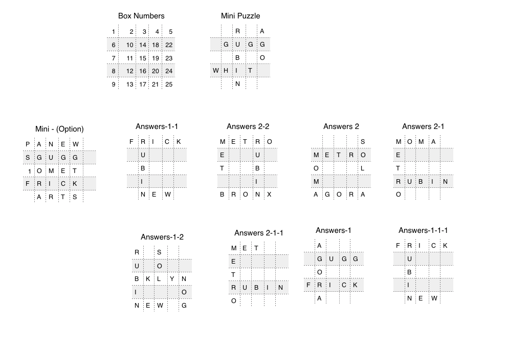
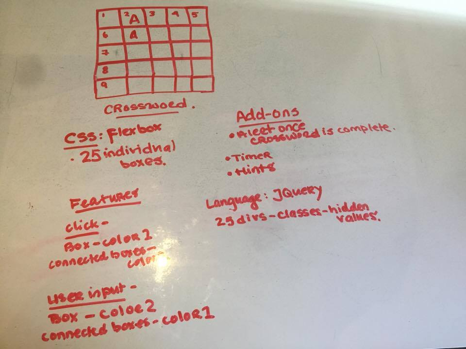
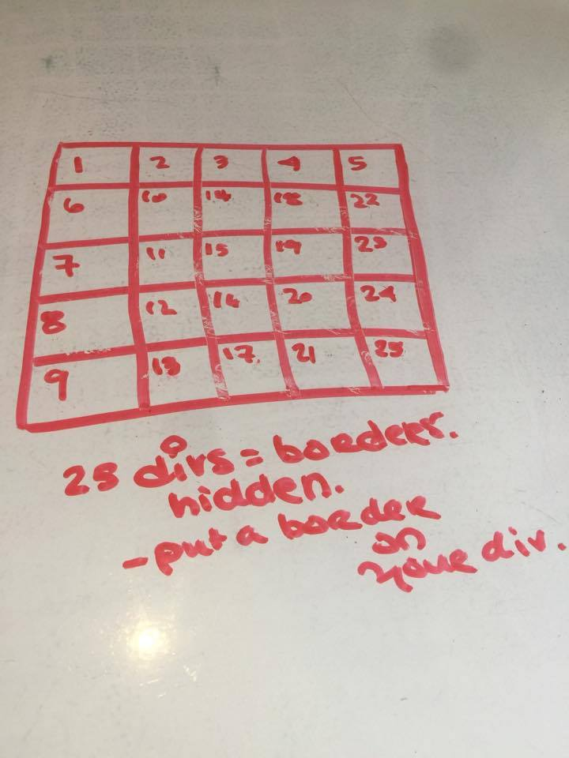
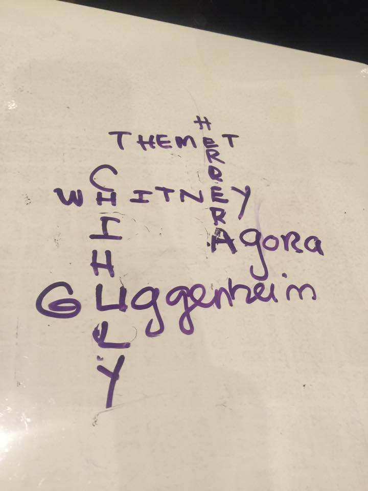

### Rachel Rondon: Crossword Puzzle
### About:

### Technologies Used
* ** Language: JQuery JavaScript Library 
  - Event listeners ("click", "blur", "keydown")
  - If/else statements
  - Two counters ("counter", "victorycounter")
  - Alert function 
* ** CSS 
  - Position:absolute
  - Flexbox 
* ** HTML 
  - Divs (one div per crossword puzzle box)
  - Input (13 input boxes)
  - Three buttons ("Hints", "Submit", "Answers")

### Approach taken
* ** For this project, I created a crossword puzzle that was inspired by the New York Times mini crossword puzzle. I was intrigued by the challenge of understanding the logic that would be needed to execute the design of alternating colors per box, row, and column. 

For my execution, I isolated each crossword puzzle box by creating a unique div and class per box. Within the JQuery document, I created a "click" event listener and a counter to keep track of the amount of clicks each box receives. This allows the CSS attributes for each box and corresponding columns/rows to alternate based on each "click". 

To make the puzzle interactive, I added 13 input boxes to the crossword puzzle. This allows the user to enter in their guess for each word. The "submit" button will visually display if the user has correctly completed the puzzle by changing the color of each crossword puzzle box. 

Addition features include a "hint" and "autofill" button. 

### User Stories 
* ** The user should be able to read the crossword puzzle questions
* ** The user should be able to input an answer into the game box
* ** The user should be able to access one hint per question through the "hints" button
* ** The user should be able to view the correct answers through the "autofill" button
* ** The user should be able to submit their answers or the answers provided by the "autofill" button through the "submit" button
* ** The user should be able to know if they have correctly or incorrectly answered the puzzle questions. 
- If the puzzle was answered correctly, all of the game boxes will turn black
- If the puzzle was answered incorrectly, all of the game boxes will turn red. 
* ** The user should be able to "click" or use the "keydown" feature to navigate through the puzzle. 
* ** The user should be able to view the crossword puzzle box that they are currently in by the blue color.
-The user should be able to view the "column" or "row" that they are currently in through the light blue color.
-The user should be able to view the "column" or "row" that they are currently in through the light blue color. 

### Wireframes

### How To Instructions
1. Read the clues listed for each word
2. To complete the puzzle, type in one letter per box 
3. Request a "hint" for any word that you are unable to identify
4. Hint - Abbreviations are included within this puzzle.
5. Press the "submit" button once the puzzle has been completed 
6. If the boxes turn black - Rejoice! 
7. If the boxes turn red - Try Again! 
8. If you are unable to complete the puzzle, press the "autofill" button. The correct letters will be entered into the puzzle.
9. Done!  

### Unsolved Problems 
* ** Responsiveness 
- Desktop 
- Mobile 
* ** "Answers" button
- Limit the amount of times the answers are inputted
* ** Additional crossword puzzle
- How to excute this on a larger scale

   

